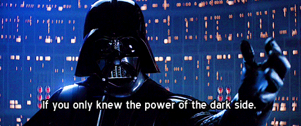

<link rel="icon" type="image/png" href="./assets/favicon-80.png">

<section class="dv-hero">
  

    
18 skills · 74% benchmark average · MIT

    <h1>Dvader Skills</h1>
    
Vader mind. Small words. Builder heart.

    
Short replies, smaller diffs, proof before <code>Work done</code>.

    

      <a href="/dvader/docs/quickstart.html">Quickstart</a>
      <a href="/dvader/docs/skills.html">Skill Map</a>
      <a href="https://www.npmjs.com/package/dvader-skills">npm</a>
    

  

  

    
    <pre><code>(Hhh-Perrr...) Work done.
Proof ran.
Next: ship.</code></pre>
  

</section>

<section class="dv-grid">
  

    <h2>Speak Less</h2>
    
Cut filler, hedging, repeated state, and ceremonial narration. Keep names, numbers, paths, commands, and error lines exact.

  

  

    <h2>Build Less</h2>
    
Use what already exists. Prefer stdlib, native platform features, and the smallest working diff.

  

  

    <h2>Prove More</h2>
    
No <code>Work done</code> without a runnable check. Test, benchmark, inspect, or show the proof that fits the change.

  

</section>

<section class="dv-band">
  <h2>The Daily Core</h2>
  
Most days need only six cards: <code>dvader-do</code>, <code>dvader-build</code>, <code>dvader-hunt</code>, <code>dvader-test</code>, <code>dvader-verify</code>, and <code>dvader-review</code>.

  
Everything else is specialized: security scans, benchmark loops, commit messages, PR shipping, memory compression, debt ledgers, and usage stats.

</section>

<section class="dv-install">
  <h2>Install</h2>
  <pre><code>npx dvader-skills -t codex
npx dvader-skills -t all
npx dvader-skills --dry-run</code></pre>
  
Restart your agent after install. Say <code>dvader</code>, <code>shorter</code>, <code>review this diff</code>, or <code>work done</code>.

</section>

<section class="dv-media">
  
  
</section>

